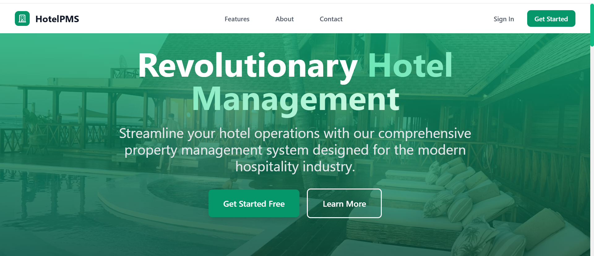
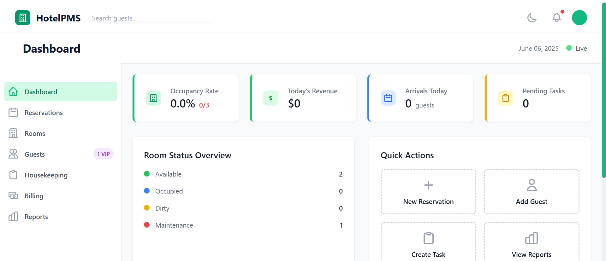
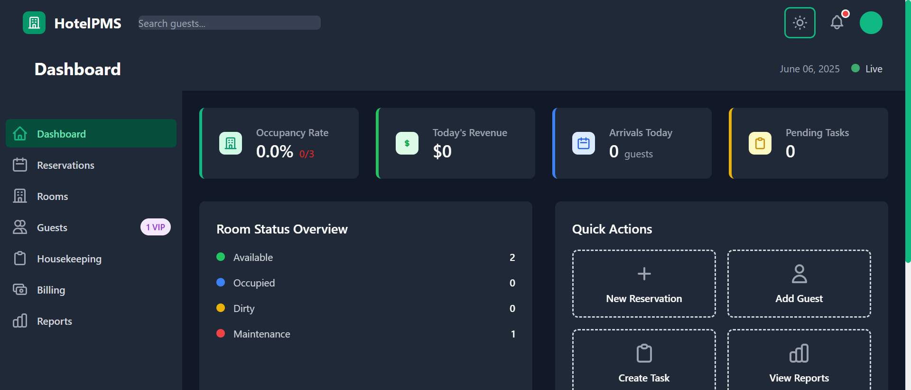
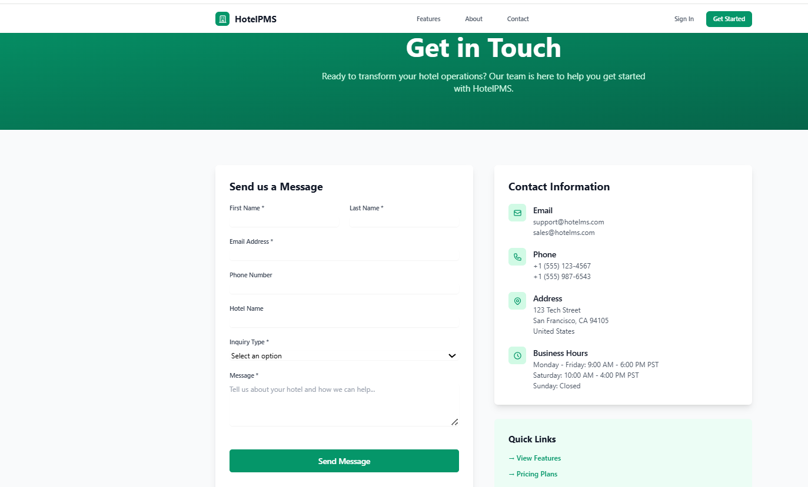

# 🏨 HotelMS - Hotel Management System

[](https://opensource.org/licenses/MIT)
[](https://www.djangoproject.com/)
[]()


A comprehensive, Django-powered hotel management system designed to streamline operations — from guest reservations and billing to housekeeping and reporting.

---

## 🌟 Features

- 🔐 **User Authentication** – Secure login and role-based access
- 🏨 **Room Management** – Track room availability, types, and statuses
- 📅 **Reservations** – Create, manage, and cancel bookings with check-in/out handling
- 🧍‍♂️ **Guest Management** – Profiles, stay history, preferences, and document support
- 💳 **Billing & Invoicing** – Generate invoices, track payments, and manage services
- 🧹 **Housekeeping** – Assign tasks, update room status, and log maintenance
- 🛎️ **Front Desk Dashboard** – Overview of arrivals, departures, and room statuses
- 📊 **Reports** – Occupancy, revenue, and audit logs
- ⚙️ **Configurable Settings** – Hotel details, taxes, logs, and more
- ⚡ **HTMX Integration** – Partial page updates for a responsive feel
- ⏱️ **Celery + Redis** – Background task support

---

## 🛠️ Tech Stack

- **Backend:** Python, Django
- **Frontend:** Django Templates, HTML, CSS, JavaScript, HTMX
- **Database:** PostgreSQL (recommended) or SQLite (default)
- **Task Queue:** Celery
- **Broker/Cache:** Redis
- **Environment:** Python `venv`, `.env` configuration

---

## 📋 Prerequisites

Before you begin, ensure you have met the following requirements:

- Python 3.10+
- pip (Python package installer)
- git (Version control)
- Redis (for Celery background tasks)
- PostgreSQL (recommended for production; SQLite is fine for development)

---

## 🚀 Getting Started

### 1. Clone the repository

```bash
git clone https://github.com/SIRI-bit-tech/HOTELMANAGEMENT
cd HOTELMANAGEMENT
```

---

### 2. Set Up Virtual Environment

```bash
# Windows
python -m venv venv
venv\Scripts\activate

# macOS/Linux
python3 -m venv venv
source venv/bin/activate
```

---

### 3. Install Dependencies

```bash
pip install -r requirements.txt
```

---

### 4. Configure Environment Variables

Create a `.env` file in the project root with the following variables:

```env
SECRET_KEY=your_strong_secret_key_here
DEBUG=True

# PostgreSQL example (uncomment and set if using PostgreSQL)
# DB_NAME=hotelms
# DB_USER=your_db_user
# DB_PASSWORD=your_db_password
# DB_HOST=localhost
# DB_PORT=5432

# Redis (used by Celery)
REDIS_URL=redis://localhost:6379/1
CELERY_BROKER_URL=redis://localhost:6379/0
CELERY_RESULT_BACKEND=redis://localhost:6379/0

# Email (for development)
EMAIL_BACKEND=django.core.mail.backends.console.EmailBackend
```

---

### 5. Apply Database Migrations

```bash
python manage.py migrate
```

---

### 6. Create a Superuser

```bash
python manage.py createsuperuser
```

Follow the prompts to set up your admin account.

---

### 7. Run the Development Server

```bash
python manage.py runserver
```

Then open http://127.0.0.1:8000 in your browser to view the application.

---

## ⚙️ Start Celery Worker

If you're using Celery for background tasks (e.g., sending emails or generating reports), run this in a separate terminal window:

```bash
celery -A hotelms worker -l info
```

---

## 📁 Project Structure

The project follows a modular Django app structure:

```
hotelms/
├── apps/                   # Main application modules
│   ├── billing/
│   ├── frontdesk/
│   ├── guests/
│   ├── housekeeping/
│   ├── reports/
│   ├── reservations/
│   ├── rooms/
│   └── users/
├── hotelms/                # Project configuration (settings.py, urls.py)
├── screenshots/            # Place your UI screenshots here
├── static/                 # Static files (CSS, JS, images)
├── templates/              # Django templates
├── manage.py
├── requirements.txt
├── .env
└── README.md
```

---

## 📸 Screenshots









---

## 🤝 Contributing

1. Fork the repository
2. Create your feature branch (`git checkout -b feature/AmazingFeature`)
3. Commit your changes (`git commit -m 'Add some AmazingFeature'`)
4. Push to the branch (`git push origin feature/AmazingFeature`)
5. Open a Pull Request

---

## 📄 License

This project is licensed under the MIT License - see the [LICENSE](LICENSE) file for details.

---

## 📞 Support

If you encounter any issues or have questions, please:

1. Check the existing [Issues](https://github.com/SIRI-bit-tech/HOTELMANAGEMENT/issues)
2. Create a new issue if your problem isn't already documented
3. Provide detailed information about your environment and the issue

---

## 🏆 Acknowledgments

- Django community for the excellent framework
- Contributors and testers who help improve this project
- Hotel industry professionals who provided insights for feature requirements